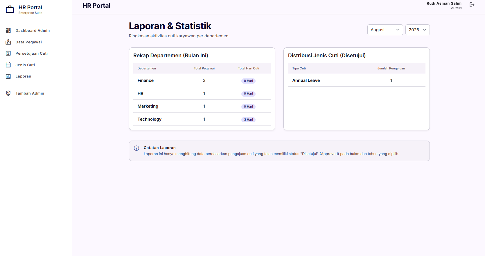

<div align="center">
    <h1>🚀 LeaveFlow - Enterprise HR & Leave Management System</h1>
    <p><i>A Production-Ready Full-Stack Web Application</i></p>
    
    
    
    
    
</div>

---

## 🌟 Executive Summary

**LeaveFlow** is a comprehensive, enterprise-grade Employee Leave Management System built to streamline HR workflows. Developed entirely with **Laravel 11**, **Tailwind CSS**, and **SQLite**, this platform showcases best practices in modern software engineering, including **Clean Architecture, Role-Based Access Control (RBAC), ACID Database Transactions, and RESTful APIs.**

This project was engineered specifically as a technical showcase to demonstrate capabilities in building secure, scalable, and visually premium full-stack applications.

---

## 📸 Application Screenshots

### 👨‍💼 Admin Dashboard (HR Manager)
> _Menampilkan data statistik, grafik, aksi cepat untuk approval cuti, dan laporan._


### 📊 Laporan & Analytics (HR Manager)
> _Rekapitulasi cuti per bulan dan filter data per departemen untuk HR._


### 🧑‍💻 Employee Dashboard
> _Halaman utama Karyawan untuk melihat riwayat aktivitas dan pengajuan mereka._


### 📝 Formulir Pengajuan Cuti (Employee)
> _Dilengkapi dengan simulasi kuota cuti tahunan dan pengecekan overlapping tanggal cuti._


---

## 🛠️ Key Technical Highlights (Why This Project Stands Out)

Bagi rekan-rekan **Recruiter / Tech Lead**, proyek ini mengimplementasikan konsep-konsep *Advanced* berikut:

1. **Robust Security & RBAC:** Memisahkan *logic* `ADMIN` dan `EMPLOYEE` menggunakan *Custom Middleware*. Karyawan tidak akan bisa menembus API atau halaman Approval Admin.
2. **ACID Database Transactions:** Menerapkan `DB::transaction()` saat proses *Approval Cuti* untuk mencegah *Race Conditions* dan memastikan integritas saldo kuota cuti.
3. **Data Validation & Overlap Prevention:** Sistem cerdas yang menolak pengajuan cuti jika *(a)* kuota tahunan tidak cukup, atau *(b)* tanggal cuti bertabrakan dengan pengajuan lain.
4. **RESTful API Enabled:** Dilengkapi dengan sistem token API (Laravel Sanctum) yang siap dikonsumsi (*headless*) oleh tim Mobile (Android/iOS) atau Frontend JS Framework (React/Vue).
5. **Custom Design System:** Menggunakan arsitektur *Bento Grid* dan *Color Palette* kustom Tailwind CSS yang menjamin konsistensi UI/UX ala aplikasi Enterprise modern.

---

## 🗄️ Database Architecture (Entity Relationship)

- **`users`** : Menyimpan autentikasi (bcrypt password) dan Role (ADMIN / EMPLOYEE).
- **`employees`** : Terhubung 1-to-1 dengan users. Menyimpan NIP, Departemen, dan **Dynamic Annual Quota**.
- **`leave_types`** : Master data jenis cuti (Tahunan, Sakit, Melahirkan, dll).
- **`leave_requests`** : Tabel transaksi dengan status lifecycle (`PENDING`, `APPROVED`, `REJECTED`).

---

## 🌐 REST API Endpoints (Sanctum)

Base URL: `http://localhost:8000/api`

| Endpoint | Method | Role | Description |
|----------|--------|------|-------------|
| `/login` | `POST` | All | Token generation |
| `/employee/leaves` | `GET/POST` | Employee | Submit & Read leave requests |
| `/employee/leaves/quota`| `GET` | Employee | Real-time quota calculation |
| `/admin/approvals/{id}` | `PUT` | Admin | Process (Approve/Reject) leaves |

---

## 🚀 How to Run Locally

1. Clone repositori ini ke dalam mesin lokal Anda.
2. Jalankan instalasi dependensi:
   ```bash
   composer install
   npm install
   ```
3. *Build* aset Tailwind CSS:
   ```bash
   npm run build
   ```
4. Jalankan migrasi dan *dummy data seeder*:
   ```bash
   php artisan migrate:fresh --seed
   ```
5. Nyalakan server lokal:
   ```bash
   php artisan serve
   ```

**Test Credentials:**
- **HR Admin:** `admin@example.com` (Pass: `password`)
- **Employee:** `employee@example.com` (Pass: `password`)

---

<div align="center">
  <p>Built with ❤️ for Rudi Asman Salim</p>
</div>
